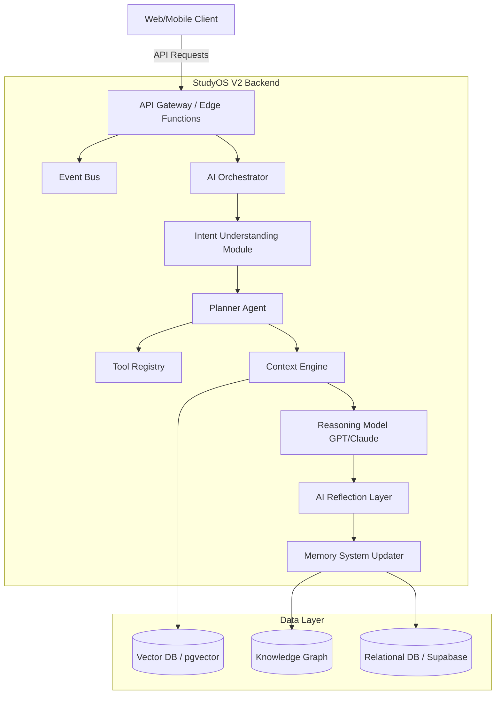

# 02 - System Architecture Specification

## 1. Purpose
Define the core architectural principles and the high-level system components of StudyOS V2. The architecture must be scalable, token-efficient, and maintain strict user privacy while retaining backward compatibility with existing StudyOS features.

## 2. Core Architectural Principles
- **Planner-first AI**: Use a planner agent to make decisions instead of relying on direct RAG.
- **Context Quality > Quantity**: Retrieve only the most relevant, compressed context.
- **Dynamic Tool Selection**: Tools should be selected intelligently based on the planner's assessment.
- **Event-driven Learning**: All user interactions act as events that update the system's state.
- **Persistent Memory**: Multi-layered long-term memory system.
- **Modular Edge Services**: Lightweight edge functions for fast execution.
- **Token-efficient Execution**: Strict token budget management.
- **Backward Compatibility**: Existing features must continue to function.
- **Privacy-First**: Strict isolation between users' data.
- **Component Independence**: Every component should be independently replaceable (model-agnostic).

## 3. High-Level Architecture Diagram

## 4. Implementation Guidance
- **Model Agnosticism**: Wrap LLM calls in an abstraction layer to allow switching between OpenAI, Anthropic, or Google models seamlessly.
- **Edge Functions**: Deploy the API layer on edge infrastructure (e.g., Supabase Edge Functions) for low latency.

## 5. Acceptance Criteria
- [ ] Core components can be swapped out without affecting the rest of the system.
- [ ] Existing StudyOS endpoints continue to function alongside V2 APIs.

## 6. Risks
- **Complexity Overhead**: Moving from a simple CRUD/RAG app to a multi-agent orchestrated architecture increases latency and maintenance complexity.

## 7. Future Extension Points
- Multi-agent collaboration frameworks.
- Local LLM integration for privacy-sensitive or offline tasks.
