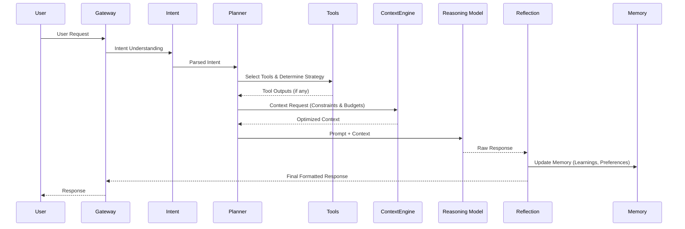

# 03 - AI Architecture Specification

## 1. Purpose
Detail the specific lifecycle of a user request as it flows through the StudyOS V2 AI components. The goal is to separate the decision-making process (Planner) from the reasoning process (GPT) to improve quality and reduce costs.

## 2. AI Lifecycle Workflow

## 3. Key Components
- **Intent Understanding**: Rapidly categorizes the user's input (e.g., explanation request, quiz generation, casual chat).
- **Planner Agent**: Decides *what* information is needed and *which* tools to call.
- **Context Engine**: Fetches, deduplicates, and compresses the requested information.
- **Reasoning Model (GPT)**: Generates the actual response using the optimized context.
- **Reflection Layer**: A lightweight post-processing step that extracts new learnings (e.g., "Student finally understood Kirchhoff's Law") and updates long-term memory.

## 4. Implementation Guidance
- The LLM should no longer decide what context to use. The Planner Agent must handle this deterministically or via a smaller, faster LLM specifically tuned for tool selection.
- Keep the Reflection step asynchronous to avoid blocking the response back to the user.

## 5. Acceptance Criteria
- [ ] Every AI request clearly follows the defined lifecycle.
- [ ] The reasoning model receives a prompt that only contains context explicitly requested by the Planner.

## 6. Risks
- **Latency**: Passing through multiple agents/layers (Intent -> Planner -> Context -> GPT -> Reflection) may introduce noticeable latency.
- **Error Cascades**: If the Planner makes a mistake, the Context Engine fetches the wrong data, and the Reasoning Model hallucinates.

## 7. Future Extension Points
- Streaming responses while the Reflection layer runs in the background.
