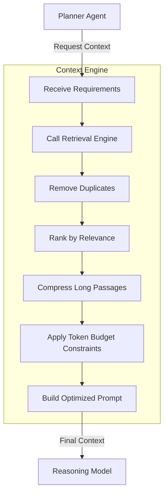

# 04 - Context Engine Design

## 1. Purpose
The Context Engine is the heart of StudyOS. It sits between the Planner Agent and the Reasoning Model. Its sole purpose is to build the most efficient, relevant, and budget-conscious context window possible before sending the prompt to the Reasoning Model.

## 2. Responsibilities
- Receive planner decisions.
- Collect only required context (via tools/Retrieval Engine).
- Rank retrieved information.
- Remove duplicates.
- Compress long passages.
- Build optimized prompts.
- Respect token budgets.
- Produce consistent prompt structures.

## 3. Workflow

## 4. Implementation Guidance
- **Token Budgeting**: Implement a strict token counting mechanism (e.g., using `tiktoken`) before making the final LLM call. Drop the lowest-ranked context if the budget is exceeded.
- **Compression**: Use lightweight summarization or semantic extraction to compress notes or long transcripts before appending them to the prompt.
- **Adaptive Depth**: The engine should support adaptive retrieval depth depending on the complexity of the request (as dictated by the Planner).

## 5. Acceptance Criteria
- [ ] The Context Engine successfully trims context to fit within the predefined token budget.
- [ ] Duplicate information (e.g., the same formula appearing in notes and previous mistakes) is merged.
- [ ] Generates a consistent, machine-readable prompt structure for the Reasoning Model.

## 6. Risks
- **Over-compression**: Aggressive compression might remove critical nuances needed by the Reasoning Model to answer the user's question accurately.

## 7. Future Extension Points
- Context caching (Semantic Caching) to reuse previously built contexts for similar queries.
