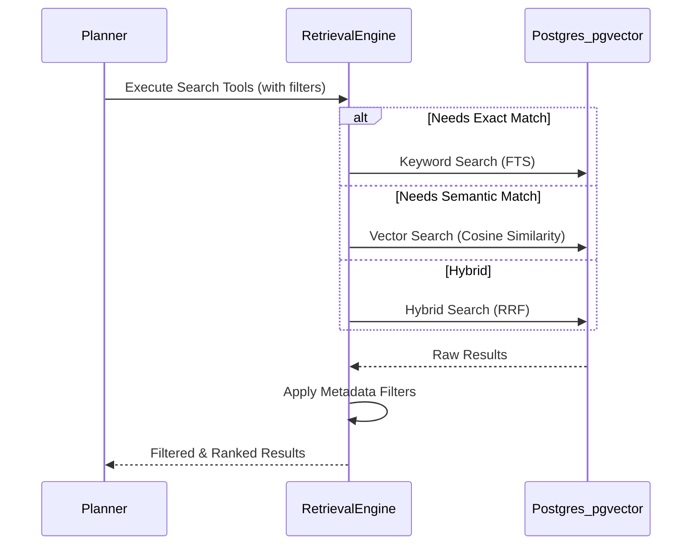

# 07 - Retrieval Engine

## 1. Purpose
Replace simple vector search with an intelligent, multi-faceted Retrieval Engine. The engine must support complex filtering and hybrid search to ensure the Context Engine receives high-quality, targeted data.

## 2. Supported Retrieval Strategies
- **Hierarchical retrieval**: Navigating from Subject -> Chapter -> Topic -> Concept.
- **Metadata filtering**: Filtering by tags (e.g., `subject:physics`, `lecturer:sir_x`).
- **Topic & Lecture filtering**: Restricting search to specific class sessions.
- **Time-based filtering**: Retrieving mistakes made "in the last 30 days."
- **Semantic retrieval**: Standard vector similarity search for concepts.
- **Hybrid keyword + vector search**: Combining exact keyword matches (e.g., specific chemical formulas) with semantic meaning.

## 3. Workflow

## 4. Implementation Guidance
- Use **Supabase / PostgreSQL with `pgvector`** for semantic search.
- Implement **Reciprocal Rank Fusion (RRF)** for hybrid search, combining Postgres Full Text Search (FTS) with vector similarity.
- The Planner decides *whether* retrieval is needed before any search occurs to save database compute.

## 5. Acceptance Criteria
- [ ] Hybrid search successfully retrieves documents where vector search alone fails (e.g., acronyms or highly specific terminology).
- [ ] Metadata filtering effectively isolates searches to specific subjects or timeframes.

## 6. Risks
- **Index Performance**: As the vector database grows, HNSW or IVFFlat indexes need careful tuning to maintain fast query times.

## 7. Future Extension Points
- Graph-based retrieval using the Knowledge Graph to traverse concept dependencies before vector search.
