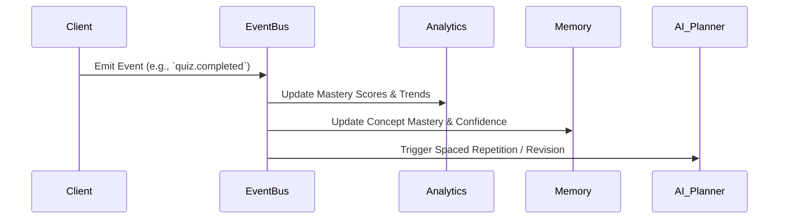

# 09 - Event System

## 1. Purpose
StudyOS V2 treats everything the student does as an event. This Event-Driven Architecture ensures that analytics, memory updates, recommendations, and planner decisions are continually fed fresh data without requiring synchronous database polling.

## 2. Event Lifecycle

## 3. Core Event Types
- **Academic Events**: `lecture.completed`, `topic.completed`, `formula.learned`.
- **Assessment Events**: `test.uploaded`, `question.answered`, `wrong.answer`, `practice_session.completed`.
- **System Events**: `note.uploaded`, `ocr.completed`, `flashcards.generated`.
- **AI Events**: `ai.explanation_requested`, `ai.reflection_completed`.

## 4. Implementation Guidance
- Use **Supabase Webhooks / Database Triggers** or a dedicated message broker (e.g., Redis Pub/Sub, Kafka) depending on scale.
- Events should be immutable. If an event is incorrect, a compensatory event must be fired.

## 5. Acceptance Criteria
- [ ] Every user action on the platform emits a standard JSON event.
- [ ] Events successfully trigger downstream updates in the Memory System.

## 6. Risks
- **Event Ordering**: In a highly asynchronous system, out-of-order events might artificially inflate or deflate a user's confidence score if not handled idempotently.

## 7. Future Extension Points
- Real-time event streaming to a teacher dashboard.
