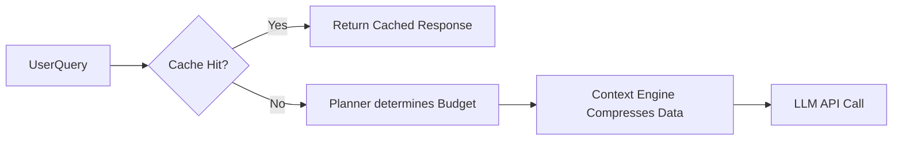

# 12 - Token Optimization Strategy

## 1. Purpose
Token efficiency is a first-class design goal. By reducing unnecessary OpenAI usage, StudyOS V2 becomes economically viable at scale while simultaneously improving answer quality (by removing noisy context).

## 2. Optimization Techniques

- **Planner-based Retrieval**: Prevent the Context Engine from running at all for simple, generic questions.
- **Semantic Caching**: Cache exact or highly similar (cosine similarity > 0.98) prompts and their responses. Serve directly from the cache to bypass the LLM entirely.
- **Prompt Compression**: Strip unnecessary formatting, stop-words, or redundant boilerplate from retrieved notes before insertion into the prompt.
- **Adaptive Context Windows**: Adjust the `max_tokens` allowed for context based on the complexity of the query. Simple queries get 500 tokens of context; complex diagnostics get 3000.
- **Retrieval Only When Necessary**: Stop inserting standard system boilerplate for every single chat turn.
- **Chunk Ranking & Duplicate Removal**: If the same concept is retrieved from a test mistake and a lecture note, merge them into a single concise bullet point.
- **Cost-aware Planning**: The Planner should assign a strict token budget to the Context Engine.
- **Incremental Retrieval**: Fetch a small amount of data first; if the LLM detects it's insufficient via a tool call, fetch more.

## 3. Workflow

## 4. Implementation Guidance
- Use a Redis cache or Supabase caching for Semantic Caching.
- Monitor token usage per user and per session to identify optimization bottlenecks.

## 5. Acceptance Criteria
- [ ] Average tokens per request drops by 30% compared to naïve RAG implementations.
- [ ] Cache hit rate for common questions (e.g., "What is the syllabus for Physics?") exceeds 40%.

## 6. Risks
- **False Cache Hits**: A semantic cache might incorrectly match a nuanced question to a generic cached answer if the similarity threshold is too low.
